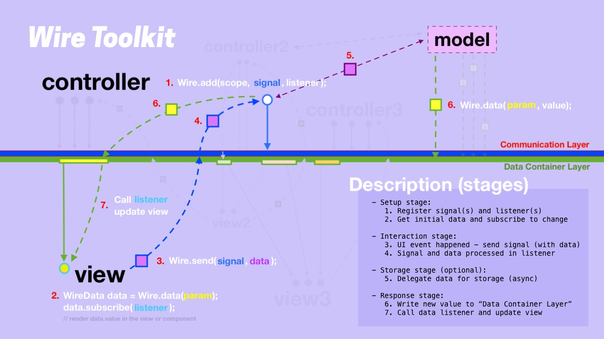
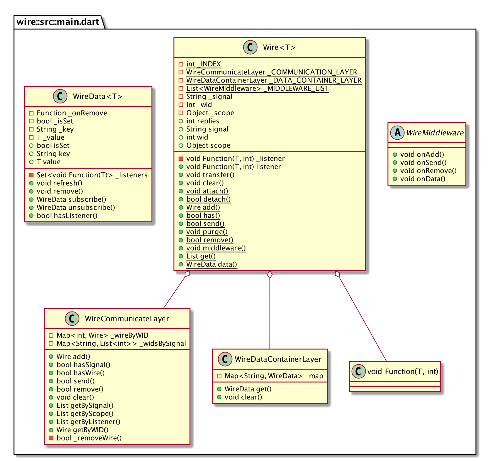

# Wire - communication and data-container layers
### Library aimed to decouple UI from business logic


It has two layers:
 - **Communication Layer** (or "bus") consists of "signals" with associated listeners inside specific scope - instances of `Wire` object. This layer has main API: `Wire.add` and `Wire.send`.
 - **Data Container Layer** - `Wire.data`, it works as a key-value in-memory map, where value is an instance of `WireData` object that holds dynamic value and can be subscribed for updates.

`WireData` also has special implementation for Flutter - [**WireDataBuilder** Widget](https://pub.dev/packages/wire_flutter). This widget makes it possible to reuse business logic in web (with any other UI frameworks like Angular) and in mobile project with Flutter. Take a look at the "example" folder in both repositories (current and [wire_flutter](https://github.com/wire-toolkit/wire_flutter/tree/master/example)) where `_shared` folder contains reusable code imported in both projects as a dart package (with custom path to package), the folder shared as a separate git branch with [git-subrepo](https://github.com/ingydotnet/git-subrepo)

[](https://www.youtube.com/watch?v=6e3OUaigjcw)

Also ported to (Work In Progress):
- [Wire Haxe](https://github.com/wire-toolkit/wire_haxe) that can help to compile or better say transpile reusable code in one of the following language: __JavaScript, Java, C#, C++, HL, Lua, PHP__.

## Usage:

Steps from diagram's description above. It's example of counter application (see folder `./example/counter`).

#### Steps: 1, 4, 6 - "box" that processes signals:

```dart
class CounterProcessor {
  CounterProcessor() {
    Wire.add(this, CounterSignal.INCREASE, (payload, wireId) {
      Wire.data(CounterDataKeys.COUNT, (value) => (value ?? 0) + 1);
    });
    Wire.add(this, CounterSignal.DECREASE, (payload, wireId) {
      Wire.data(CounterDataKeys.COUNT, (int value) => (value ?? 0) > 0 ? value - 1 : 0);
    });
  }
}
```

Since there is no Model box in this example, the processor (or controller) updates data by itself the steps 4 and 6 are the part of it.

#### Steps: 2, 7 - View subscribe to data changes and know how to update itself:

```dart
class CounterDisplay extends DomElement {
  CounterDisplay():super(DivElement()) {
    // ... DOM initialization and styling
    final wireData = Wire.data(CounterDataKeys.COUNT);
    wireData.subscribe(update);
    update(wireData.value ?? 0);
  }
  // update or render
  void update(value) { dom.text = value.toString(); }
}
```

#### Step: 3 - another View translate UI event to the system signal:

```dart
class CounterButton extends DomElement {
  CounterButton(String title, String signal):super(ButtonElement()) {
    // ... DOM initialization and styling
    dom.onClick.listen((_) => Wire.send(signal));
  }
}
```

Adding wires and `WireListener`s to the system. In reaction its immediately set new value to data-container layer from function that do decision making `Wire.data(CounterDataKeys.COUNT, (oldValue) => newValue)`.

#### Steps: 4, 5 - "middleman" who catch all whats happening in the system (in this example it stores counter value to localStorage):

```dart
class CounterStorageMiddleware extends WireMiddleware {
  final ls = window.localStorage;

  int getInitialValue() {
    return ls.containsKey(CounterDataKeys.COUNT) ?
      int.parse(ls[CounterDataKeys.COUNT]) : 0;
  }

  @override
  void onData(String key, prevValue, nextValue) {
    print('> CounterMiddleware -> onData: key = ${key} | ${prevValue}-${nextValue}');
    if (key == CounterDataKeys.COUNT) {
      if (nextValue != null) ls[key] = nextValue.toString();
      else { if (ls.containsValue(key)) ls.remove(key); }
    }
  }

  @override void onAdd(Wire wire) { }
  @override void onRemove(String signal, [Object scope, listener]) { }
  @override void onSend(String signal, [data, scope]) { }
}
```

This "middleman" can be considered as a part of a Model.

#### Initialization:

```dart
void init() {
  final counterStorageMiddleware = CounterStorageMiddleware();
  // Set initial value from local storage
  Wire.data(CounterDataKeys.COUNT, counterStorageMiddleware.getInitialValue());
  // Register middleware after setting initial value to prevent saving initial value
  Wire.middleware(counterStorageMiddleware);
  // Register processor(s) in the system by just creating and instance of it
  processor = CounterProcessor();
  // Create and initialize view parts of the application
  final root = document.querySelector('#root');
  application = ApplicationView(root);
}
```

### That simple!

## Preface

Key to a good software product is understanding of how things work together, what do what, software design, separation of concerns and responsibilities, SOLID principles. Here is a good saying from Robert C. Martin:
 > "Architecture is not about making decisions earlier, but making decisions late. Good architecture is a software structure that allows you to defer critical decisions for as long as possible, defer them to the point where you've got enough information to actually make them, or not make them".

It's always good to protect your business rules from UI changes and make the user interface **a plug-in** to the business rules, same for domain data make it a plug-in to the business rules and UI. 

## History

Being in software development over decade now (2020) I have seem many projects built with different tools and platforms, most of them dealt with user interactions and UI layer(s), and I’ve seen, and still see, the same problems everywhere - no strict rules between UI and data, rules are needed to create order, order creates beauty, and beauty survive and thrive. Even if some framework provides these rules and relations between entities they don't have specific tools to force use them, and usually people break them in favor to release feature faster, therefor a software systems could end up in chaos, where business logic mixed with UI and other parts, domain data generate (or resend) from view and coupled with logic of how this data rendered, and other operations that is not related to the view layer (e.g. requests to remote end points). Remember (from Robert C. Martin):
> "The only way to go fast, is to go well."

Separation, putting things outside of boundaries, make parts as **plugins** - that's what I've been thinking about for years, looking at how others work, how things connected, how data propagated through and used in different popular frameworks, in companies custom solutions. And what I realized is that - it all rotated around two concepts:
1. Data propagation mechanism
2. Events distribution system

And they both can be represented as an API - **Events API** and **Data API**, both could be just a sets of keys without any obligations - set of strings. This idea leads to the concept of layers - two distribution layers one for communication, events or signals, another one for data. That’s how idea of Wire came to life!
This way entities expose two parts:
- what it needs (what data it use or expect to use)
- what actions it produces (what can be processed)

Component post this information in unique collection of strings - component's Events API and Data API, or it might use general collections shared APIs presented as strings only. Anyway it does not know from where the data come from and who will process actions.


## Goal
The aim of this library is to decouple business logic or any logic that makes decisions on data processing, decouple it from UI - this allows to have shared code that can be imported to different projects, with completely different UIs, with any entity.
 > It's about shared code that can be plug-in or loaded at runtime when it's needed.

## General Concepts
A software system consists in leveraging three main concepts:
1. Data storage and distribution.
2. Events listening and propagation.
3. Decision making based on that data (or FSM).

You find these concepts in every program. Basically it's called - Model-View-Controller - meta-pattern or idea of separating program on functional pieces. Understanding MVC is about understanding how programs should work. 
 
### Model
Data structure and the ways how to access data define how an application works and how to apply changes. Therefore data definition is the first step in software development. All starts with data. In MVC, the fact that Model is in the first position emphasize it as well. Models in application play a wider role than just value objects definition, it's also a way of how these objects are stored and retrieved, you can think of it as a data API - create, update, delete and etc. Does it make any decisions on how to modify the data? Probably not, maybe only update related data (e.g. in-memory counter of completed todos). And don't forget that there are two types of models - active and passive, one can notify when changes have occurred (active) and another is a plain storage, file or database (passive) - it has to be monitored by a controller or another agent. 
Next the example of one of TodoModel's methods: 
```dart
TodoVO create(String text, String note) {
    final todoVO = TodoVO(uuid(), text, note, false);
    final listData = Wire.data(TodoDataParams.LIST);
    final todoList = listData.value as List;
    final count = Wire.data(TodoDataParams.COUNT).value as int;

    todoList.add(todoVO.id);
    Wire.data(todoVO.id, todoVO);
    Wire.data(TodoDataParams.LIST, todoList);
    Wire.data(TodoDataParams.COUNT, count + 1);

    _save();

    print('> TodoModel -> created: ' + todoVO.id + ' - ' + todoVO.text);
    return todoVO;
}
```
`Wire.data('key')` plays a role of active model, it holds `WireData` instances associated with string keys, `WireData` is a container with data (accessed from `.value` property) and it can be monitored for updates by subscribing to it - `WireData.subscribe((value) => { ... })`. To update the value and notify listeners just set the value: `Wire.data('key', value)`. That's simple. It's up to you to decide from where the value (`WireData.value`) will be updated either from separate entity, a model by calling its data API (together with physical storing in database or sending to a server), or you can do it from controller afterwards when sub-processes will be ended.

### View
UI also could have its own state - visual state, and it might not need to be stored in persistent storage at all, only temporarily. Example - accordion’s opened tab, or button hover state, tooltips, input highlight and etc. These states might depend on domain's data and are generated in run-time based on some conditions. Yes, view could have logic inside, but it has to be simple branching conditions and only depends on data passed in, not from multiple data sources, if it is then this is a sign of needed refactoring (for example extracting condition into pre-calculated object property - UserVO.canRoleBeChanged). With `Wire` view consume data from Data Container Layer - `Wire.data(value)`, then view subscribe to updates and re-render itself when change will happen - `WireData.subscribe((value) => { ... })`. 
```dart
class TodoCountView extends DomElement {
  TodoCountView(SpanElement dom):super(dom) {
    var wireData = Wire.data(TodoDataParams.COUNT);
    var update = (value) => dom.innerText = value.toString();
    wireData.subscribe(update);
    update(wireData.value);
  }
}
```
But not every program has a view, servers might not have UI, and it all depends on the definition of the view. Saying View we mean something that can emit external events about outside world or interaction, and incoming network traffic fit to this definition quite well, and in this case Wire can be a distribution gate for network API calls, just call `Wire.send(signal, dto)` on network events and every part of internal system can react to it. `Wire.send` is a Communication Layer - a way to completely separate parts of the application. View sends signals and waits for data to be updated. Other parts of the view can listen for signals as well and update themselves accordingly. `Signal` is a string type constant and all of them represent Events API of the component or a system.

### Controller
 Decision making - business logic - the rules, the controller. It's a place where data meet events, their data are mixed with other data, compared and distributed to a model for CRUD operations, then view updates. 
 > We believe and promote the idea that's view is 'just' the UI layer, with the real app being the logic and data kept outside the components tree.

<sub align="right">from original article [Thoughts on React Hooks, Redux, and Separation of Concerns](https://blog.isquaredsoftware.com/2019/07/blogged-answers-thoughts-on-hooks/)</sub>

Based on this belief we recommend to keep all your business logic, all these data processing and decision making logic outside of a view - in controllers, this is the only right place to do that. **Signals listeners placed inside controller**. You register a signal by adding it to the Communication Layer with `Wire.add(scope, signal, listener)`. Many signals can be connected to the same listener and vice versa. The listener should follow the specification of WireListener and has two params - data payload it distributes and wire identifier (wid - string constant). 
```dart
class TodoController {
    TodoModel todoModel;
    TodoController(this.todoModel) {
    
    Wire.add(this, ViewSignals.INPUT, (String data, int wid) {
      var text = data;
      print('> TodoProcessor -> TodoViewOutputSignal.INPUT: ' + text);
      if (text != null && text.isNotEmpty) {
        todoModel.create(text);
        Wire.send(ViewSignals.CLEAR_INPUT);
      }
    });
    
    Wire.add(this, ViewSignals.DELETE, (String data, int wid) {
      var todoId = data;
      print('> TodoProcessor -> TodoViewOutputSignal.DELETE: ' + todoId);
      todoModel.remove(todoId);
    });

    // Or there can be one listener - signal processor
    Wire.add(this, ViewSignals.INPUT,  _signalProcessor);
    Wire.add(this, ViewSignals.EDIT,   _signalProcessor);
    Wire.add(this, ViewSignals.DELETE, _signalProcessor);
    Wire.add(this, ViewSignals.TOGGLE, _signalProcessor);
    // ...
  }

  void _signalProcessor(DTO payload, int wid) {
    var wire = Wire.get(wid: wid).single;
    print('> TodoProcessor -> ${wire.signal}: data = ' + payload.toString());
    // ...
  }
}
```
In controller you make a decision of how to process input data, do calculation, then data delegated to a model(s), stored or sent to the server, then controller might initiate reaction - send another signal or if data was not updated from model (in Data Container Layer) then controller might update it manually (with `Wire.data(key, value)`). Application can have multiple controllers each responsible to its particular data processing. You might think of them as reducers from Redux world or commands from PureMVC.

## Few words about FLUX
[FLUX pattern](https://facebook.github.io/flux/docs/in-depth-overview) is a modification of MVC idea, where **data flow unidirectional** and controllers replaced with so-called "controller-views": 
> "Views often found at the top of the hierarchy that retrieve data from the stores and pass this data down to their children."


But in general it's all MVC, **Wire** incorporate these ideas of Flux, but also allows consumers of data additionally react on signals from other parts of the system, basically from anywhere, beside provides a way to manually subscribe to data changes. The basic flow is next:
1. Consumers request the data and subscribe for its updates - register reactions.
2. Signals produced somewhere in the system (maybe by the same data consumers) or come from outside (e.g. network requests).
3. Listeners react to signals and process data coming with them, these listeners are controllers and update data in stores, which then will trigger reactions (also they can send new signals, but its just an options).

## Wire in Flutter / [WireDataBuilder<T>](https://pub.dev/packages/wire_flutter)
Having business logic separated from presentation, events distributed in Communication Layer and data accessible from shared layer (Wire.data) it's now possible to consume the data and send signal from UI easily. In Flutter this means that we can leave visual hierarchy, UI rendering and transitions between screens/pages to the Flutter framework, and consume data in places where it's needed, we can do this with special widget - `WireDataBuilder<T>({Key key, String dataKey, Builder builder})` which subscribe with a string `dataKey` to WireData value and its changes, it rebuilds underlying widget you return from `builder` function when WireData value updated. However if you need only data in place you still can get it directly with `Wire.data('key').value`. Here is an example from [Todo](https://github.com/wire-toolkit/wire_flutter/tree/master/example/wire_flutter_todo) application:
Here is Wire in Flutter
```dart
class StatsCounter extends StatelessWidget {
  StatsCounter() : super(key: ArchSampleKeys.statsCounter);
  @override
  Widget build(BuildContext context) {
    return Center(
      child: WireDataBuilder<int>( // <----- Subscribe to update
        dataKey: DataKeys.COUNT, // <------ Data key (string)
        builder: (context, int notCompletedCount) {
          var allTodoCount = Wire.data(DataKeys.LIST).value.length; // <---- Access data without listening for its change
          var numCompleted = allTodoCount - notCompletedCount;
          return Column(
            mainAxisAlignment: MainAxisAlignment.center,
            children: [
              ...
```

# WIRE API
### Wire<T> (static methods):
```
Wire .add<T>(Object scope, String signal, WireListener<T> listener, [int replies = 0])
bool .send<T>(String signal, {T payload, Object scope}) // Payload or DTO stands for Data Transfer Object
bool .remove(String signal, {Object scope, WireListener listener})
bool .has({String signal, Wire wire})
void .attach(Wire wire)
bool .detach(Wire wire)
bool .purge()
void .middleware(WireMiddleware value)
List<Wire> .get({String signal, Object scope, WireListener listener, int wid})

WireData .data<T>(String key, [T value])
```

### WireListener<T>:
Definition of listener to a signal in `Wire.add(scope, signal, listener)`
To get signal use `Wire.get(wid:wid).single`
```
void Function(T payload, int wid)
```

### WireData<T>:
It is a data container that holds dynamic value. WireData can be subscribed (and unsubscribed). It is associated with string key and retrieved from in-memory map with `Wire.data(key)`. WireData **can't** be null and `Wire.data(key)` will always return WireData instance, but its **initial value can be null** (if first call does not have value, e.g.`Wire.data(key, null)`), to check this initial null value WireData has special property `isSet`, which is `false` until not null value won't be set for the first time. To remove value from Data Container Layer use method `remove()` - it emits null value before remove subscribers and WireData instance, use `isSet` property to to distinguish between newly created (false) and removed.
```
WireData subscribe(WireDataListener<T> listener)
WireData unsubscribe(WireDataListener<T> listener)
void refresh()
void remove()
T get value
```

### WireDataListener<T>:
Definition of WireData listener in `WireData.subscribe(scope, listener)`
```
void Function(T value);
```

### WireMiddleware:
Class that extends WireMiddleware's methods can be added to `Wire.middleware(middleware)`
```
abstract class WireMiddleware {
  void onAdd(Wire wire);
  void onSend(String signal, [payload, scope]);
  void onRemove(String signal, [Object scope, WireListener listener]);
  void onData(String param, dynamic prevValue, dynamic nextValue);
}
```



Generate UML with `dcdg` (PlantUML): `pub global run dcdg -o ./uml/configuration`

## Examples
### 1. Counter (web):
- Open IDEA
- Select build target - Dart Web, point to example/counter/index.html
- Run Debug

### 2. Todo MVC:
**2.1 Dart Web and HTML template**:


- Open IDEA
- Select build target - Dart Web, point to example/todo/index.html
- Run Debug

***2.2 Todo MVC and Flutter***:


[repo](https://github.com/wire-toolkit/wire_flutter/tree/master/example/wire_flutter_todo)

### 2.1 Todo Angular

- Open IDEA
- Create symlink (or anchor on Windows) from "_shared/todo" folder in "example" folder and put the link in to "todo_angular/lib/src/_shared" folder.
- Run DartWeb configuration with index.html

### 3. API calls variations (console):
- Open IDEA
- Select build target - Dart Command Line App, point to example/api/wire_api_example.dart
- Run Debug

## Licence

```
Copyright 2020 Vladimir Cores (Minkin)

Licensed under the Apache License, Version 2.0 (the "License");
you may not use this file except in compliance with the License.
You may obtain a copy of the License at

   http://www.apache.org/licenses/LICENSE-2.0

Unless required by applicable law or agreed to in writing, software
distributed under the License is distributed on an "AS IS" BASIS,
WITHOUT WARRANTIES OR CONDITIONS OF ANY KIND, either express or implied.
See the License for the specific language governing permissions and
limitations under the License.
```
