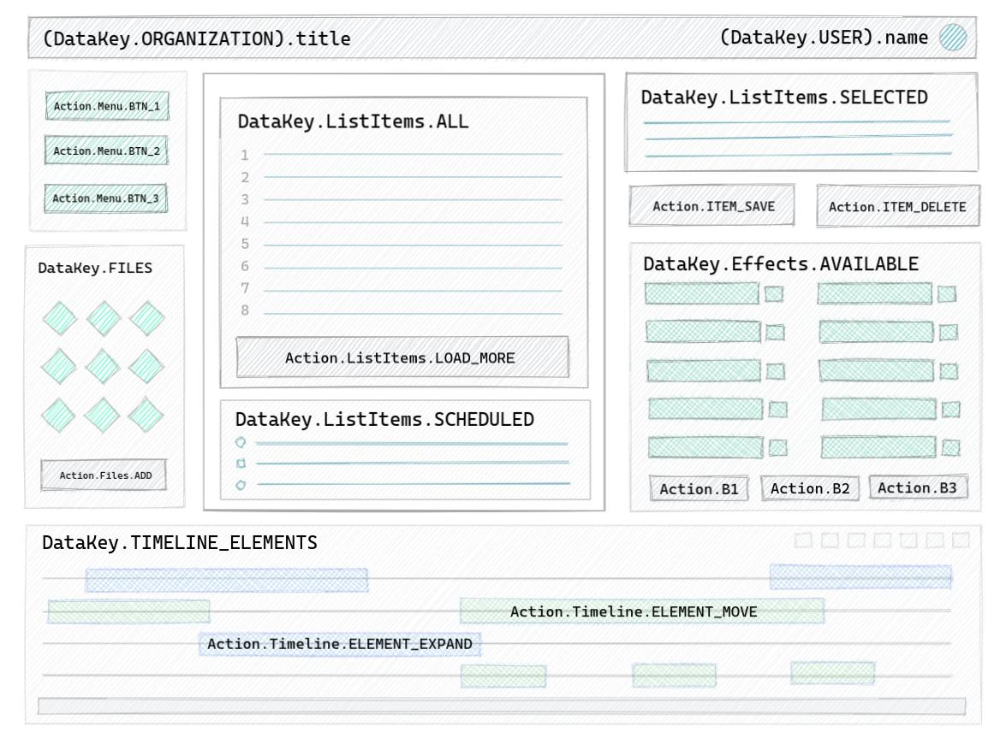

# Wire is communication and data-container layers
These layers consist of string keys that bound to handler's methods and various types of data. This is realization of idea of "Strings API" when each component of the system - logical or visual - represented as a set of strings - whats component consumes is "Data API" and whats it produces or reacts to is "Signals API".

## Library aimed to decouple UI from business logic


It has two layers:
 - **Communication Layer** - consists of "signals" with associated listeners bound to specific scope - instances of `Wire` object. This layer has main API: `Wire.add` and `Wire.send`.
 - **Data Container Layer** - it is a key-value in-memory map, where value is an instance of `WireData` object that holds dynamic value and can be subscribed for updates, main API: `Wire.data`.

`WireData` has special implementation for Flutter - [**WireDataBuilder** Widget](https://pub.dev/packages/wire_flutter). This widget makes it possible to reuse business logic in web and in mobile project with Flutter. Take a look at the "example" folder in both repositories (current and [wire_flutter](https://github.com/wire-toolkit/wire_flutter/tree/master/example)) where `_shared` folder contains reusable code imported in both projects as a dart package (with custom path to package), the folder shared as a separate git branch with [git-subrepo](https://github.com/ingydotnet/git-subrepo)

[](https://www.youtube.com/watch?v=6e3OUaigjcw)

Wire library also ported to (work in progress, and currently outdated):
- [Wire Haxe](https://github.com/wire-toolkit/wire_haxe) that can help to compile or better say transpile reusable code in one of the following language: __JavaScript, Java, C#, C++, HL, Lua, PHP__.

## Usage:

Steps from diagram's description above. It's example of counter web-application (see folder `./example/counter`).

#### Steps: 1, 4, 6 - "box" that processes signals:

Adding wires and `WireListener`s to the system. In response, it's immediately set new value to data-container layer from function that do decision-making `Wire.data(CounterDataKeys.COUNT, (oldValue) => newValue)`.

```dart
class CounterController {
  CounterController() {
    // 1. scope, string key, handler function
    Wire.add(this, CounterSignalsKeys.INCREASE, (dynamic payload, wireId) async {
      // 4. handler function process signal async
      // new value could be function or plain value
      Wire.data(CounterDataKeys.COUNT, value: (value) {
        final count = value as int?;
        // 6. Update data
        return (count ?? 0) + 1;
      });
    });
    // Handler for CounterSignalsKeys.DECREASE see in the source code
  }
}
```

Since there is no Model "box" in counter example, the controller updates data by itself in steps 4 and 6.

#### Steps: 2, 7 - View subscribes to data changes and knows how to update itself:

```dart
class CounterDisplay extends DomElement {
  CounterDisplay() : super(DivElement()) {
    dom.className = 'spectrum-Body spectrum-Body--L';

    final wireData = Wire.data(CounterDataKeys.COUNT);
    wireData.subscribe(update);
    update(wireData.value ?? 0); // View could define default value
  }

  Future<void> update(value) async {
    print('> CounterDisplay -> update: ${value}');
    dom.text = value.toString();
  }
}
```

#### Step: 3 - another View translate UI event to a signal:

```dart
class CounterButton extends DomElement {
  CounterButton(String title, String signal):super(ButtonElement()) {
    // DOM initialization and styling
    final span = SpanElement()
      ..text = title
      ..title = title
      ..className = 'spectrum-Button-label';
    dom // dom is a component from super constructor
      ..className = 'spectrum-Button spectrum-Button--primary'
      ..onClick.listen((event) => Wire.send(signal)) // Catch user interaction and produce signal
      ..append(span);
  }
}
```

#### Steps: 4, 5 - "middleman" who catch all what's happening in the system (in this example it stores counter value to localStorage):

```dart
class CounterStorageMiddleware extends WireMiddleware {
  final ls = window.localStorage;

  int getInitialValue() {
    return ls.containsKey(CounterDataKeys.COUNT) ?
      int.parse(ls[CounterDataKeys.COUNT]) : 0;
  }

  @override
  void onData(String key, prevValue, nextValue) {
    print('> CounterMiddleware -> onData: key = ${key} | ${prevValue}-${nextValue}');
    if (key == CounterDataKeys.COUNT) {
      if (nextValue != null) ls[key] = nextValue.toString();
      else { if (ls.containsValue(key)) ls.remove(key); }
    }
  }

  @override void onAdd(Wire wire) { }
  @override void onRemove(String signal, [Object scope, listener]) { }
  @override void onSend(String signal, [data, scope]) { }
}
```

This middleware may be considered as a part of a Model.

### Initialization:

```dart
void main() {
  /// COUNTER EXAMPLE ======================================
  final counterStorageMiddleware = CounterStorageMiddleware();
  // Set initial value from local storage, could be part of CounterStorageMiddleware constructor.
  Wire.data(CounterDataKeys.COUNT, value: counterStorageMiddleware.getInitialValue());
  // Register middleware after setting initial value to prevent saving initial value
  Wire.middleware(counterStorageMiddleware);
  // Instantiate controller that register all signal processing
  CounterController();
  // Find root in index.html and map it to functional component
  final root = document.querySelector('#root');
  ApplicationView(root as DivElement?);
}
```

## Words on architecture

Key to a good software product is understanding of how things work together, what do what and where - software design - separation of concerns and responsibilities, DRY, KISS and SOLID principles. Here is a good saying from Robert C. Martin:
 > "Architecture is not about making decisions earlier, but making decisions late. Good architecture is a software structure that allows you to defer critical decisions for as long as possible, defer them to the point where you've got enough information to actually make them, or not make them".

It's always good to separate (protect) your business rules from UI changes and make the user interface **a plug-in** to the business rules (and vice-versa), same for domain data make it as a plug-in to the business rules and UI.

## Use of Command Pattern

Good practice is to extract data manipulation logic in a reusable, composable classes. The Command Pattern together with Wire is a perfect fit for that. Let's explore example of Todo Application with use of commands as processing units for signals (see project in folder`example/todo-commands`).

### Register commands

```dart
class TodoController {
  TodoController() {
    Wire.addMany(this, {
      ViewSignals.INPUT:    (_, __) => TodoInputCommand(_! as InputDTO).execute(),
      ViewSignals.EDIT:     (_, __) => TodoEditCommand(_! as EditDTO).execute(),
      ViewSignals.DELETE:   (_, __) => TodoDeleteCommand(_! as String).execute(),
      ViewSignals.TOGGLE:   (_, __) => TodoToggleCommand(_! as String).execute(),
      // Utilities
      ViewSignals.FILTER:          (_, __) => ApplyFilterToTodosCommand(_! as FilterValues).execute(),
      ViewSignals.CLEAR_COMPLETED: (_, __) => ClearCompletedTodosCommand().execute(),
      ViewSignals.COMPLETE_ALL:    (_, __) => CompleteAllTodosCommand(_! as bool).execute()
    });
    // Getter - shrink complex conditions on multiple data source to single data key
    Wire.data(DataKeys.GET_COUNT_COMPLETED, getter: CountCompletedGetter().getter);
  }
}
```

Each `...Command` is a class extended from utility class `WireCommandWithWireData` that has `execute` method and some utilities methods to simplify data extraction from `Wire.data` (get, update, delete) and their constructor may accept properties. In that `execute` method logic is written:

```dart

class TodoEditCommand extends WireCommandWithWireData<void> {
  TodoEditCommand(this.editTodoDTO);

  final EditDTO editTodoDTO;

  @override
  Future<void> execute() async {
    final todoText = editTodoDTO.text;
    final todoNote = editTodoDTO.note;
    final todoId = editTodoDTO.id;
    if (todoText.isEmpty) {
      _removeTodo(todoId);
    } else {
      _updateTodo(todoId, todoText, todoNote);
    }
    print('> TodoEditCommand -> toggled: id = ${todoId} - ${todoText} - ${todoNote}');
  }
  //... _removeTodo and _updateTodo methods implementation
}
```

You don't need to use `WireCommandWithWireData` as a base for your commands with additional helper methods but `WireCommandAbstract` might be useful as a mark for commands that processed from Wire's signals, and asynchronous nature allow to use them in a sequence.

## Some history of Strings API idea

Being in software development over decade now I have seen many projects built with different tools and technologies, most of them dealt with user interactions and UI layer(s), and I’ve seen, and still see, the same problems everywhere - no strict rules between UI and data, rules are needed to create order, order creates beauty, and beauty survive and thrive. Even if some framework provides these rules and relations between entities they don't have specific tools to force use of them, and usually people break them in favor to release feature fast, therefore a software systems could end up in chaos, where business logic mixed with UI and other parts, domain data generated (or resend) from view and coupled with logic of how this data rendered, and other operations that is not related to the view layer (e.g. requests to remote end points). Remember (from Robert C. Martin):
> "The only way to go fast, is to go well."

Separation, putting things outside of boundaries, make parts as **plugins** - that's what I've been thinking about over years, looking at how others work, how things connected, how data propagated through and used in different popular frameworks and in companies custom solutions. And what I realized is that - it all rotated around two concepts:
1. Data propagation mechanism
2. Events distribution system

And they both can be represented as an API of a component - **Events API** and **Data API**, both could be just a sets of keys (strings) without any obligations. This idea leads to the concept of layers - two distribution layers one for communication, events or signals, another for data. That was how idea of Wire came to life!
This way entities of the system expose two parts:
- what it needs (what data it uses or expects to use)
- what actions it produces (what can be processed)

Component exposes this information in unique collection of strings - component's "Events API" and "Data API", or it might use general collections shared APIs presented as strings only. Anyway it does not know from where the data come from and who will process actions.

## General Concepts of MVC
A software system consists of three main concepts:
1. Data storage and distribution.
2. Events listening and propagation.
3. Decisions making based on that data (and FSM).

You find these concepts in every program. Basically it's called - Model-View-Controller - meta-pattern or idea of separating program on functional pieces.

### Model
Data structure and the ways how to access data define how an application works and how to apply changes. Therefore data definition is the first step in software development. All starts with data. In MVC, the fact that Model is in the first position emphasize it as well. Models in application play a wider role than just value objects definition, it's also a way of how these objects are stored and retrieved, you can think of it as a data API - create, update, delete, and etc. Does model make any decisions on how to modify the data? Probably not, maybe only update related data (e.g. in-memory counter of completed todos). And don't forget that there are two types of models - active and passive, one can notify when changes have occurred (active) and another is a plain storage, file or database (passive) - it has to be monitored by a controller or another agent.

Next an example of one of TodoModel's methods (from Todo Application example, different from one above in Command Pattern):

```dart
TodoVO create(String text, String note, bool completed) {
  final newTodoId = DateTime.now().millisecondsSinceEpoch.toString();
  final newTodoVO = TodoVO(newTodoId, text, note, completed);

  final todoIdsList = Wire.data(DataKeys.LIST_OF_IDS).value as List<String>;
  final count = Wire.data(DataKeys.COUNT).value as int;

  todoIdsList.add(newTodoId);

  // Add todo to data layer
  Wire.data(newTodoVO.id, value: newTodoVO);
  // Update todo list in data layer
  Wire.data(DataKeys.LIST_OF_IDS, value: todoIdsList);
  // Update completed todos counter
  Wire.data(DataKeys.COUNT, value: count + (completed ? 0 : 1));

  _checkOnCompleteAll();
  _saveChanges();

  print('> TodoModel -> created: ${newTodoVO.id} - ${newTodoVO.text}');
  return newTodoVO;
}
```

`Wire.data('key')` plays a role of active model, it holds `WireData` instances associated with string key, `WireData` is a container with data (value accessed from `.value` property) and it can be observed for changes by subscribing - `WireData.subscribe((value) => { ... })`. To update the value and notify listeners just set the value: `Wire.data('key', value: value)`. It's up to you to decide from where the value (`WireData.value`) will be updated either from separate entity, a model (together with physical storing in database or sending to a server), or you can update data directly from controller, or a command.

### View
UI also could have its own state - visual state, and this state might not need to be stored in persistent storage at all, only temporarily. Example - accordion’s opened tab, or button hover state, tooltips, input highlight and etc. These states might depend on domain's data and are generated in run-time based on some conditions. Yes, view could have logic inside, it could be branching conditions that depend on data passed in (`WireDataGetter` could simplify multiple conditions with `WireData`). With `Wire` view consume data from Data Container Layer - `Wire.data`, then view subscribes to update and re-render itself when change will happen - `WireData.subscribe((value) => { ... })`. If domain data suppose to be changed or modified in the view (forms) it is good practice to copy it and send to process after modification in the view.

```dart
class CounterDisplay extends DomElement {
  CounterDisplay() : super(DivElement()) {
    dom.className = 'spectrum-Body spectrum-Body--L';
    final wireData = Wire.data(CounterDataKeys.COUNT);
    wireData.subscribe(update);
    update(wireData.value ?? 0);
  }

  Future<void> update(value) async {
    print('> CounterDisplay -> update: ${value}');
    dom.text = value.toString();
  }
}
```

This how data distribution might looks like in an app


#### Network Communication
Not every program has a view, servers might not have UI, and it all depends on the definition of the view. Saying View we mean something that can emit external events about outside world or interaction, and incoming network traffic fit to this definition quite well, and in this case Wire can be a distribution gate for network API calls, just call `Wire.send(signal, dto)` on network events and every part of internal system can react to it. `Wire.send` is a Communication Layer - a way to completely separate parts of the application. View sends signals and waits for data to be updated. Other parts of the view can listen for signals as well and update themselves accordingly.

### Controller
 Decision-making on multiple sources of data - business logic - the rules, the controller. It's a place where data meet signals (events), their data are mixed with data from other sources, compared and CRUD operations, then view updates.

 > We believe and promote the idea that's view is 'just' the UI layer, with the real app being the logic and data kept outside the components tree.

<sub align="right">from original article [Thoughts on React Hooks, Redux, and Separation of Concerns](https://blog.isquaredsoftware.com/2019/07/blogged-answers-thoughts-on-hooks/)</sub>

Based on this belief we recommend to keep all your business logic, all these data processing and decisions making logic outside of a view - in controllers, this is the only right place to do that. **Signals listeners placed inside controller**. You register a signal by adding it to the Communication Layer with `Wire.add(scope, signal, listener)` or `Wire.addMany(scope, signalToHandlerMap)`. Many signals can be connected to the same listener and vice versa. The listener should follow the specification of `WireListener` and has two params - data payload and wire identifier (wid - string constant).

```dart
class TodoController {
    TodoModel todoModel;
    TodoController(this.todoModel) {

    Wire.add(this, ViewSignals.INPUT, (String data, int wid) {
      var text = data;
      print('> TodoProcessor -> TodoViewOutputSignal.INPUT: ' + text);
      if (text != null && text.isNotEmpty) {
        todoModel.create(text);
        Wire.send(ViewSignals.CLEAR_INPUT);
      }
    });

    Wire.add(this, ViewSignals.DELETE, (String data, int wid) {
      var todoId = data;
      print('> TodoProcessor -> TodoViewOutputSignal.DELETE: ' + todoId);
      todoModel.remove(todoId);
    });

    // Or there can be one listener - signal processor
    Wire.add(this, ViewSignals.INPUT,  _signalProcessor);
    Wire.add(this, ViewSignals.EDIT,   _signalProcessor);
    Wire.add(this, ViewSignals.DELETE, _signalProcessor);
    Wire.add(this, ViewSignals.TOGGLE, _signalProcessor);
    // ...
  }

  void _signalProcessor(DTO payload, int wid) {
    var wire = Wire.get(wid: wid).single;
    print('> TodoProcessor -> ${wire.signal}: data = ' + payload.toString());
    // ...
  }
}
```

In a controller you make a decision of how to process input data, do calculation, then data delegated to a model(s) if any, stored or sent to the server, then controller might initiate reaction - send another signal or if data was not updated from model (in Data Container Layer) then controller might update data manually (with `Wire.data(key, value)`). Application can have multiple controllers each responsible to its particular data processing. You might also think of them as reducers from Redux world or commands from PureMVC.

## Few words about FLUX
[FLUX pattern](https://facebook.github.io/flux/docs/in-depth-overview) is a modification of MVC idea, where **data flow unidirectional** and controllers replaced with so-called "controller-views":
> "Views often found at the top of the hierarchy that retrieve data from the stores and pass this data down to their children."


But in general it's all MVC, **Wire** incorporate these ideas of Flux, but also allows consumers of data additional reaction on signals from other parts of the system, basically from anywhere, beside provides a way to manually subscribe to data changes. The basic flow is next:
1. Consumers request the data and subscribe for its updates - register reactions.
2. Signals produced somewhere in the system (maybe by the same data consumers) or come from outside (e.g. network requests).
3. Listeners react to signals and process incoming data, these listeners are controllers and update data in stores, which then will trigger reactions (also they can send new signals, but its just an options).

## Wire in Flutter / [WireDataBuilder<T>](https://pub.dev/packages/wire_flutter)
Having business logic separated from presentation, events distributed in Communication Layer and data accessible from shared layer (Wire.data) it's now possible to consume the data and send signal from UI easily. In Flutter this means that we can leave visual hierarchy, UI rendering and transitions between screens/pages to the Flutter framework, and consume data in places where it's needed, we can do this with special widget - `WireDataBuilder<T>({Key key, String dataKey, Builder builder})` which subscribe with a string `dataKey` to WireData value and its changes, it rebuilds underlying widget you return from `builder` function when WireData value updated. However if you need only data in place you still can get it directly with `Wire.data('key').value`. Here is an example from [Todo](https://github.com/wire-toolkit/wire_flutter/tree/master/example/wire_flutter_todo) application:
Here is Wire in Flutter
```dart
class StatsCounter extends StatelessWidget {
  StatsCounter() : super(key: ArchSampleKeys.statsCounter);
  @override
  Widget build(BuildContext context) {
    return Center(
      child: WireDataBuilder<int>( // <----- Subscribe to update
        dataKey: DataKeys.COUNT, // <------ Data key (string)
        builder: (context, notCompletedCount) {
          var allTodoCount = (Wire.data(DataKeys.LIST).value as List).length; // <---- Access data
          var numCompleted = allTodoCount - notCompletedCount;
          return Column(
            mainAxisAlignment: MainAxisAlignment.center,
            children: [
              // ...
            ]);
      }));
  }
}
```

# WIRE API
### Wire<T> (static methods):
```
Future<Wire<T>> .add<T>(Object scope, String signal, WireListener<T> listener, [int replies = 0])
Future<List<Wire<dynamic>>> .addMany(Object scope, Map<String, WireListener<dynamic>> signalToHandlerMap)
Future<bool> .send<T>(String signal, {T payload, Object scope}) // Payload or DTO stands for Data Transfer Object
Future<bool> .remove(String signal, {Object scope, WireListener listener})
bool .has({String signal, Wire wire})
void .attach(Wire wire)
bool .detach(Wire wire)
Future<void> .purge({bool? withMiddleware})
void .middleware(WireMiddleware value)
List<Wire> .get({String signal, Object scope, WireListener listener, int wid})

WireData .data<T>(String key, [T value])
```

### WireListener<T>:
Definition of listener to a signal in `Wire.add(scope, signal, listener)`
To get signal use `Wire.get(wid:wid).single`
```
void Function(T payload, int wid)
```

### WireData<T>:
It is a data container that holds dynamic value. WireData can be subscribed (and unsubscribed). It is associated with string key and retrieved from in-memory map with `Wire.data(key)`. WireData **can't** be null and `Wire.data(key)` will always return WireData instance, but its **initial value can be null** (if first call does not have value, e.g.`Wire.data(key, null)`), to check this initial null value WireData has special property `isSet`, which is `false` until not null value won't be set for the first time. To remove value from Data Container Layer use method `remove()` - it emits null value before remove subscribers and WireData instance, use `isSet` property to distinguish between newly created (false) and removed.

```
WireData subscribe(WireDataListener<T> listener)
WireData unsubscribe(WireDataListener<T> listener)
void refresh()
void remove()
T get value
bool WireData.lock(WireDataLockToken token)
bool WireData.unlock(WireDataLockToken token)
bool get WireData.isLocked
```

### WireDataListener<T>:
Definition of WireData listener in `WireData.subscribe(WireDataListener)`
```
Future<void> Function(dynamic value);
```

### WireMiddleware:
Class that extends WireMiddlewares methods can be added to `Wire.middleware(WireMiddleware)`

```
abstract class WireMiddleware {
  void onAdd(Wire wire);
  void onSend(String signal, [payload, scope]);
  void onRemove(String signal, [Object scope, WireListener listener]);
  void onData(String param, dynamic prevValue, dynamic nextValue);
}
```


Generate UML with `dcdg` (PlantUML): `pub global run dcdg -o ./uml/configuration`

## Examples
### 1. Counter (web):
- Open IDEA
- Select build target - Dart Web, point to example/counter/index.html
- Run Debug

### 2. Todo MVC:
**2.1 Dart Web and HTML template (or commands)**:


- Open IDEA
- Select build target - Dart Web, point to example/todo/index.html
- Run Debug

**2.2 Todo MVC and Flutter**:


[repo](https://github.com/wire-toolkit/wire_flutter/tree/master/example/wire_flutter_todo)

### 2.1 Todo Angular

- Open IDEA
- Create symlink (or anchor on Windows) from "_shared/todo" folder in "example" folder and put the link in to "todo_angular/lib/src/_shared" folder.
- Run DartWeb configuration with index.html

### 3. API calls variations (console):
- Open IDEA
- Select build target - Dart Command Line App, point to example/api/wire_api_example.dart
- Run Debug

## Licence

```
Copyright 2020-2022 Vladimir Cores (Minkin)

Licensed under the Apache License, Version 2.0 (the "License");
you may not use this file except in compliance with the License.
You may obtain a copy of the License at

   http://www.apache.org/licenses/LICENSE-2.0

Unless required by applicable law or agreed to in writing, software
distributed under the License is distributed on an "AS IS" BASIS,
WITHOUT WARRANTIES OR CONDITIONS OF ANY KIND, either express or implied.
See the License for the specific language governing permissions and
limitations under the License.
```
