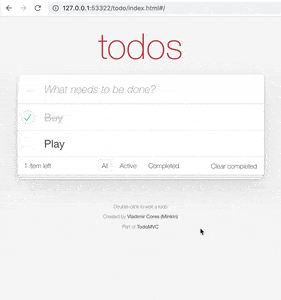
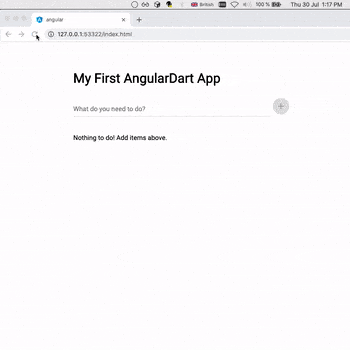
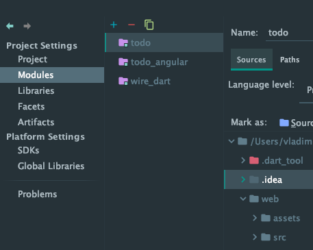
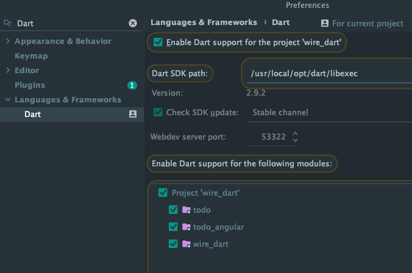

## Examples

For every project in example folder you have to run `pub get` from terminal or from IDE opened `pubspec.yaml`

### 1. Counter (web): Simple "Increase/Decrease/Output" example of Wire use 
- Open IDEA
- Select build target - Dart Web, point to example/counter/index.html
- Run Debug

### 2. Todo MVC (web): Complex Todo application based on TodoMVC CSS

- Open IDEA
- Select build target - Dart Web, point to example/todo/index.html
- Run Debug

### 3. API calls variations (console): Possible variation of Wire API use
- Open IDEA
- Select build target - Dart Command Line App, point to example/api/wire_api_example.dart
- Run Debug

### 4. Todo with AngularDart web

- Open folder from IDEA
- Create symlink (or anchor on Windows) from "_shared" folder in "example" folder and put the link in to "todo_angular/lib/src/" folder.
- Run DartWeb configuration with index.html

### Setup in IDEA:
To run these examples import them as a module from `File -> Project Structure` in IDEA and enable Dart SDK for each from `Preferences -> Languages & Frameworks -> Dart`

